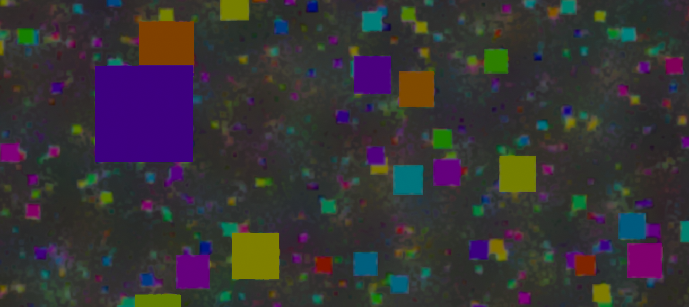

# VFX-DoFError-ReproProject
Test project to reproduce VFX/HDRP Depth of Field errors

# Updated: New Issues with HDRP + DXR, Volume serialization, and Path Tracing

Based on feedback from the HDRP team, I updated the project to 2020.2.6f1 (HDRP version 10.3.1 and 10.3.2) and have attempted to use Path-Traced Depth of Field to help improve visual quality. Since the intended project does not require realtime performance, rendering frame by frame is adequate for my use case. However, after the update I am having new issues.

## NEW: Error 3: Volume Array/Serialization

After updating to 2020.2.6f1 and going through the HD Render Pipeline Wizard to configure support for HDRP + DXR, Volumes no longer work properly. Attempting to add more than one Effect to a Volume results in an array access error and a serialization error to be reported to the console. This happens regardless of whether the Effect is related to DXR/Raytraced featureset; any Effect that is past index 0 seems to be affected.

## NEW: Error 4: Path Tracing does not render VFX

When Path Tracing is enabled in the Volume, VFX systems are not rendered at all. This is extremely strange! 
Other objects (meshes, etc.) are rendered, but VFX particles are not.

I have verified that Path Tracing is enabled both for the Camera and the project settings.

Here are screenshots showing both of these issues:

This image shows the Volume error messages which appear when trying to add a second Effect to the Volume, and the completely black output to the Game view when Path Tracing is enabled.

This image shows the expected VFX visibility (though obviously without Path Traced rendering, Depth of Field, or other effects).

-----

# Original Report
 
I have identified two different visual errors with the Unity HDRP Depth of Field effect when used in conjunction with the Visual Effect Graph system. Tested on Unity 2020.1.16f1, with HDRP version 8.3.1.
 
## Error 1: Weird Bokeh 'Doubling' - Explained but not resolved

In some situations - seemingly when a particle is 'in between' the fully blurred out bokeh splat and 'nearly in focus' blurred states - the particle is visibly drawn directly on top of the bokeh splat. At low resolutions this looks fine, but at higher resolutions (4K, 8K, etc.) it is very obviously drawing the particle 'in focus' and the bokeh splat at the same time. This 'doubling' is not an optical phenomenon we see with real lenses; it looks weird.

Sampling at higher resolution in DoF quality settings helps, but only to an extent. The 'doubling' effect is always there. In addition, raising the DoF quality settings can cause crashes and instability; in older versions of Unity 2020.1x it can actually cause the entire DoF and HDRP stack to fail due to kernel errors (lol).

Response:

>  Transparent surfaces, like floating particles, will not work properly with post-process DoF. The reason is that DoF is using the depth of each pixel for the computations and for each pixel we store only one depth value, which is not enough when multiple transparent particles fall in the same pixel.
  
  
Note - the project does not use any transparent rendering (all particles are rendered as opaque, and at the moment there is not even alpha testing enabled). While I understand conceptually that there is still a limitation of one depth value per pixel (and thus some artifacting is unavoidable), I am still struggling to understand how that produces the 'doubling' result. I would expect that in Opaque render mode(s) it would just ZTest as normal and still end up with a mostly coherent result - IE, whichever particle is closest to the camera is preserved and used as the source for DoF. This would still cause some visual issues with cases like overlapping particles at dissimilar depths, but I don't think it would look like this? Perhaps I am misunderstanding the explanation.

## Error 2: 'Artifacting' - Currently unexplained

When there are a large number of particles that are very nearly defocused, it creates a strange visual artifact that is similar to jpeg or video compression. There is a rapid change between blurred and unblurred pixels, and it looks very much like digital noise. As with the doubling issue, at lower resolutions the issue is much less noticeable, but as the resolution increases it becomes more and more apparent. And again, this effect is reduced at higher sample settings, but is always present to some extent, and raising the sampling settings causes instability.
